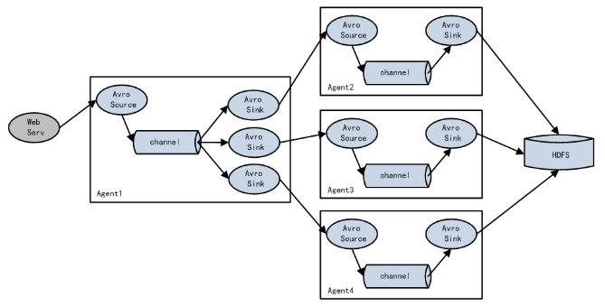

# **第1章 Flume概述**

## **1.1** **Flume定义**

Flume是Cloudera提供的一个高可用的，高可靠的，分布式的海量日志采集、聚合和传输的系统。Flume基于流式架构，灵活简单。


## **1.2** **Flume基础架构**

Flume组成架构如下图所示。

 

### **1.2.1 Agent**

Agent是一个JVM进程，它以事件的形式将数据从源头送至目的。

Agent主要有3个部分组成，Source、Channel、Sink。

### **1.2.2 Source**

Source是负责接收数据到Flume Agent的组件。Source组件可以处理各种类型、各种格式的日志数据，包括avro、thrift、exec、jms、spooling directory、netcat、sequence generator、syslog、http、legacy。

### **1.2.**3 Sink

Sink不断地轮询Channel中的事件且批量地移除它们，并将这些事件批量写入到存储或索引系统、或者被发送到另一个Flume Agent。

Sink组件目的地包括hdfs、logger、avro、thrift、ipc、file、HBase、solr、自定义。

### **1.2.**4 Channel

Channel是位于Source和Sink之间的缓冲区。因此，Channel允许Source和Sink运作在不同的速率上。Channel是线程安全的，可以同时处理几个Source的写入操作和几个Sink的读取操作。

Flume自带两种Channel：Memory Channel和File Channel。

Memory Channel是内存中的队列。Memory Channel在不需要关心数据丢失的情景下适用。如果需要关心数据丢失，那么Memory Channel就不应该使用，因为程序死亡、机器宕机或者重启都会导致数据丢失。

File Channel将所有事件写到磁盘。因此在程序关闭或机器宕机的情况下不会丢失数据。

### **1.2.5 Event**

传输单元，Flume数据传输的基本单元，以Event的形式将数据从源头送至目的地。Event由**Header**和**Body**两部分组成，Header用来存放该event的一些属性，为K-V结构，Body用来存放该条数据，形式为字节数组。

 

# **第2章 Flume入门**

## **2.1** **Flume安装部署**

### 2.1.1 **安装地址**

（1） Flume官网地址：<http://flume.apache.org/>

（2）文档查看地址：<http://flume.apache.org/FlumeUserGuide.html>

（3）下载地址：http://archive.apache.org/dist/flume/

### **2.1.2** **安装部署**

（1）将apache-flume-1.9.0-bin.tar.gz上传到linux的/opt/software目录下

（2）解压apache-flume-1.9.0-bin.tar.gz到/opt/module/目录下

```shell
tar -zxf /opt/software/apache-flume-1.9.0-bin.tar.gz -C /opt/module/
```

（3）修改apache-flume-1.9.0-bin的名称为flume

```shell
mv /opt/module/apache-flume-1.9.0-bin /opt/module/flume
```

（4）将lib文件夹下的guava-11.0.2.jar删除以兼容Hadoop 3.1.3

```shell
rm /opt/module/flume/lib/guava-11.0.2.jar
```

## **2.2** **Flume入门案例**

### **2.2.1** **监控端口数据官方**案例

**1）案例需求：**

使用Flume监听一个端口，收集该端口数据，并打印到控制台。 

**2）需求**分析：

**3）实现步骤：**

（1）安装netcat工具

```shell
[atguigu@hadoop102 software]$ sudo yum install -y nc
```

（2）判断44444端口是否被占用

```shell
[atguigu@hadoop102 flume-telnet]$ sudo netstat -tunlp | grep 44444
```

（3）创建Flume Agent配置文件flume-netcat-logger.conf

在flume目录下创建job文件夹并进入job文件夹。

```shell
[atguigu@hadoop102 flume]$ mkdir job
[atguigu@hadoop102 flume]$ cd job/
```

在job文件夹下创建Flume Agent配置文件flume-netcat-logger.conf。

```shell
[atguigu@hadoop102 job]$ vim flume-netcat-logger.conf
```

在flume-netcat-logger.conf文件中添加如下内容。

```shell
添加内容如下：
# Name the components on this agent
a1.sources = r1
a1.sinks = k1
a1.channels = c1

# Describe/configure the source
a1.sources.r1.type = netcat
a1.sources.r1.bind = localhost
a1.sources.r1.port = 44444

# Describe the sink
a1.sinks.k1.type = logger

# Use a channel which buffers events in memory
a1.channels.c1.type = memory
a1.channels.c1.capacity = 1000
a1.channels.c1.transactionCapacity = 100

# Bind the source and sink to the channel
a1.sources.r1.channels = c1
a1.sinks.k1.channel = c1
```

注：配置文件来源于官方手册<http://flume.apache.org/FlumeUserGuide.html>


（4）先开启flume监听端口

第一种写法：

```shell
[atguigu@hadoop102 flume]$ bin/flume-ng agent --conf conf/ --name a1 --conf-file job/flume-netcat-logger.conf -Dflume.root.logger=INFO,console
```

第二种写法：

```shell
[atguigu@hadoop102 flume]$ bin/flume-ng agent -c conf/ -n a1 -f job/flume-netcat-logger.conf -Dflume.root.logger=INFO,console
```

参数说明：

​	--conf/-c：表示配置文件存储在conf/目录

​	--name/-n：表示给agent起名为a1

​	--conf-file/-f：flume本次启动读取的配置文件是在job文件夹下的flume-telnet.conf文件。

​	-Dflume.root.logger=INFO,console ：-D表示flume运行时动态修改flume.root.logger参数属性值，并将控制台日志打印级别设置为INFO级别。日志级别包括:log、info、warn、error。

（5）使用netcat工具向本机的44444端口发送内容

```shell
[atguigu@hadoop102 ~]$ nc localhost 44444
hello 
atguigu
```

（6）在Flume监听页面观察接收数据情况

 

思考：nc hadoop102 44444，flume能否接收到？

### **2.2.2 实时监控单个追加文件**

**1**）案例需求：实时监控Hive日志，并上传到HDFS中

2）需求分析：

**3**）实现步骤：

（1）Flume要想将数据输出到HDFS，依赖Hadoop相关jar包

检查/etc/profile.d/my_env.sh文件，确认Hadoop和Java环境变量配置正确

```shell
#JAVA_HOME
export JAVA_HOME=/opt/module/jdk1.8.0_212
export PATH=$PATH:$JAVA_HOME/bin

##HADOOP_HOME
export HADOOP_HOME=/opt/module/hadoop-3.1.3
export PATH=$PATH:$HADOOP_HOME/bin
export PATH=$PATH:$HADOOP_HOME/sbin
```

（2）创建flume-file-hdfs.conf文件

创建文件

```shell
[atguigu@hadoop102 job]$ vim flume-file-hdfs.conf
```

注：要想读取Linux系统中的文件，就得按照Linux命令的规则执行命令。由于Hive日志在Linux系统中所以读取文件的类型选择：exec即execute执行的意思。表示执行Linux命令来读取文件。

添加如下内容

```
# Name the components on this agent
a2.sources = r2
a2.sinks = k2
a2.channels = c2

# Describe/configure the source
a2.sources.r2.type = exec
a2.sources.r2.command = tail -F /opt/module/hive/logs/hive.log
a2.sources.r2.shell = /bin/bash -c

# Describe the sink
a2.sinks.k2.type = hdfs
a2.sinks.k2.hdfs.path = hdfs://hadoop102:8020/flume/%Y%m%d/%H
#上传文件的前缀
a2.sinks.k2.hdfs.filePrefix = logs-
#是否按照时间滚动文件夹
a2.sinks.k2.hdfs.round = true
#多少时间单位创建一个新的文件夹
a2.sinks.k2.hdfs.roundValue = 1
#重新定义时间单位
a2.sinks.k2.hdfs.roundUnit = hour
#是否使用本地时间戳
a2.sinks.k2.hdfs.useLocalTimeStamp = true
#积攒多少个Event才flush到HDFS一次
a2.sinks.k2.hdfs.batchSize = 100
#设置文件类型，可支持压缩
a2.sinks.k2.hdfs.fileType = DataStream
#多久生成一个新的文件
a2.sinks.k2.hdfs.rollInterval = 60
#设置每个文件的滚动大小
a2.sinks.k2.hdfs.rollSize = 134217700
#文件的滚动与Event数量无关
a2.sinks.k2.hdfs.rollCount = 0

# Use a channel which buffers events in memory
a2.channels.c2.type = memory
a2.channels.c2.capacity = 1000
a2.channels.c2.transactionCapacity = 100

# Bind the source and sink to the channel
a2.sources.r2.channels = c2
a2.sinks.k2.channel = c2
```

**注意**：

对于所有与时间相关的转义序列，Event Header中必须存在以 “timestamp”的key（除非hdfs.useLocalTimeStamp设置为true，此方法会使用TimestampInterceptor自动添加timestamp）。

a3.sinks.k3.hdfs.useLocalTimeStamp = true


（3）运行Flume

```shell
[atguigu@hadoop102 flume]$ bin/flume-ng agent --conf conf/ --name a2 --conf-file job/flume-file-hdfs.conf
```

（4）开启Hadoop和Hive并操作Hive产生日志

```
[atguigu@hadoop102 hadoop-2.7.2]$ sbin/start-dfs.sh
[atguigu@hadoop103 hadoop-2.7.2]$ sbin/start-yarn.sh

[atguigu@hadoop102 hive]$ bin/hive
hive (default)>
```

（5）在HDFS上查看文件。


### **2.2.3 实时监控目录下多个新文件**

**1）**案例需求：使用Flume监听整个目录的文件，并上传至HDFS

2）需求分析：

**3）实现步骤：**

（1）创建配置文件flume-dir-hdfs.conf

创建一个文件

```shell
[atguigu@hadoop102 job]$ vim flume-dir-hdfs.conf
```

添加如下内容

```shell
a3.sources = r3
a3.sinks = k3
a3.channels = c3

# Describe/configure the source
a3.sources.r3.type = spooldir
a3.sources.r3.spoolDir = /opt/module/flume/upload
a3.sources.r3.fileSuffix = .COMPLETED
a3.sources.r3.fileHeader = true
#忽略所有以.tmp结尾的文件，不上传
a3.sources.r3.ignorePattern = ([^ ]*\.tmp)

# Describe the sink
a3.sinks.k3.type = hdfs
a3.sinks.k3.hdfs.path = hdfs://hadoop102:8020/flume/upload/%Y%m%d/%H
#上传文件的前缀
a3.sinks.k3.hdfs.filePrefix = upload-
#是否按照时间滚动文件夹
a3.sinks.k3.hdfs.round = true
#多少时间单位创建一个新的文件夹
a3.sinks.k3.hdfs.roundValue = 1
#重新定义时间单位
a3.sinks.k3.hdfs.roundUnit = hour
#是否使用本地时间戳
a3.sinks.k3.hdfs.useLocalTimeStamp = true
#积攒多少个Event才flush到HDFS一次
a3.sinks.k3.hdfs.batchSize = 100
#设置文件类型，可支持压缩
a3.sinks.k3.hdfs.fileType = DataStream
#多久生成一个新的文件
a3.sinks.k3.hdfs.rollInterval = 60
#设置每个文件的滚动大小大概是128M
a3.sinks.k3.hdfs.rollSize = 134217700
#文件的滚动与Event数量无关
a3.sinks.k3.hdfs.rollCount = 0

# Use a channel which buffers events in memory
a3.channels.c3.type = memory
a3.channels.c3.capacity = 1000
a3.channels.c3.transactionCapacity = 100

# Bind the source and sink to the channel
a3.sources.r3.channels = c3
a3.sinks.k3.channel = c3
```


（2）启动监控文件夹命令

```shell
[atguigu@hadoop102 flume]$ bin/flume-ng agent --conf conf/ --name a3 --conf-file job/flume-dir-hdfs.conf
```

说明：在使用Spooling Directory Source时，不要在监控目录中创建并持续修改文件；上传完成的文件会以.COMPLETED结尾；被监控文件夹每500毫秒扫描一次文件变动。

（3）向upload文件夹中添加文件

在/opt/module/flume目录下创建upload文件夹

```shell
[atguigu@hadoop102 flume]$ mkdir upload
```

向upload文件夹中添加文件

```shell
[atguigu@hadoop102 upload]$ touch atguigu.txt
[atguigu@hadoop102 upload]$ touch atguigu.tmp
[atguigu@hadoop102 upload]$ touch atguigu.log
```

（4）查看HDFS上的数据

 

（5）等待1s，再次查询upload文件夹

```shell
[atguigu@hadoop102 upload]$ ll
总用量 0
-rw-rw-r--. 1 atguigu atguigu 0 5月  20 22:31 atguigu.log.COMPLETED
-rw-rw-r--. 1 atguigu atguigu 0 5月  20 22:31 atguigu.tmp
-rw-rw-r--. 1 atguigu atguigu 0 5月  20 22:31 atguigu.txt.COMPLETED
```


### **2.2.4** **实时监控目录下的多个追加文件**

Exec source适用于监控一个实时追加的文件，不能实现断点续传；Spooldir Source适合用于同步新文件，但不适合对实时追加日志的文件进行监听并同步；而Taildir Source适合用于监听多个实时追加的文件，并且能够实现断点续传。

**1）**案例需求：使用Flume监听整个目录的实时追加文件，并上传至HDFS

**2）**需求分析：

3）实现步骤：

（1）创建配置文件flume-taildir-hdfs.conf

创建一个文件

```shell
[atguigu@hadoop102 job]$ vim flume-taildir-hdfs.conf
```

添加如下内容

```shell
a3.sources = r3
a3.sinks = k3
a3.channels = c3

# Describe/configure the source
a3.sources.r3.type = TAILDIR
a3.sources.r3.positionFile = /opt/module/flume/tail_dir.json
a3.sources.r3.filegroups = f1 f2
a3.sources.r3.filegroups.f1 = /opt/module/flume/files/.*file.*
a3.sources.r3.filegroups.f2 = /opt/module/flume/files/.*log.*

# Describe the sink
a3.sinks.k3.type = hdfs
a3.sinks.k3.hdfs.path = hdfs://hadoop102:8020/flume/upload2/%Y%m%d/%H
#上传文件的前缀
a3.sinks.k3.hdfs.filePrefix = upload-
#是否按照时间滚动文件夹
a3.sinks.k3.hdfs.round = true
#多少时间单位创建一个新的文件夹
a3.sinks.k3.hdfs.roundValue = 1
#重新定义时间单位
a3.sinks.k3.hdfs.roundUnit = hour
#是否使用本地时间戳
a3.sinks.k3.hdfs.useLocalTimeStamp = true
#积攒多少个Event才flush到HDFS一次
a3.sinks.k3.hdfs.batchSize = 100
#设置文件类型，可支持压缩
a3.sinks.k3.hdfs.fileType = DataStream
#多久生成一个新的文件
a3.sinks.k3.hdfs.rollInterval = 60
#设置每个文件的滚动大小大概是128M
a3.sinks.k3.hdfs.rollSize = 134217700
#文件的滚动与Event数量无关
a3.sinks.k3.hdfs.rollCount = 0

# Use a channel which buffers events in memory
a3.channels.c3.type = memory
a3.channels.c3.capacity = 1000
a3.channels.c3.transactionCapacity = 100

# Bind the source and sink to the channel
a3.sources.r3.channels = c3
a3.sinks.k3.channel = c3
```


（2）启动监控文件夹命令

```shell
[atguigu@hadoop102 flume]$ bin/flume-ng agent --conf conf/ --name a3 --conf-file job/flume-taildir-hdfs.conf
```

（3）向files文件夹中追加内容

在/opt/module/flume目录下创建files文件夹

```shell
[atguigu@hadoop102 flume]$ mkdir files
```

向upload文件夹中添加文件

```shell
[atguigu@hadoop102 files]$ echo hello >> file1.txt
[atguigu@hadoop102 files]$ echo atguigu >> file2.txt
```


（4）查看HDFS上的数据

 

**Taildir**说明：

​	Taildir Source维护了一个json格式的position File，其会定期的往position File中更新每个文件读取到的最新的位置，因此能够实现断点续传。Position File的格式如下：

```shell
{"inode":2496272,"pos":12,"file":"/opt/module/flume/files/file1.txt"}
{"inode":2496275,"pos":12,"file":"/opt/module/flume/files/file2.txt"}
```


注：Linux中储存文件元数据的区域就叫做inode，每个inode都有一个号码，操作系统用inode号码来识别不同的文件，Unix/Linux系统内部不使用文件名，而使用inode号码来识别文件。

# **第3章 Flume进阶**

## **3.1** **Flume事务**


## **3.2** **Flume** **Agent内部原理**


**重要组件：**

**1）**ChannelSelector

ChannelSelector的作用就是选出Event将要被发往哪个Channel。其共有两种类型，分别是Replicating（复制）和Multiplexing（多路复用）。

ReplicatingSelector会将同一个Event发往所有的Channel，Multiplexing会根据相应的原则，将不同的Event发往不同的Channel。

**2）SinkProcessor**

SinkProcessor共有三种类型，分别是DefaultSinkProcessor、LoadBalancingSinkProcessor和FailoverSinkProcessor

DefaultSinkProcessor对应的是单个的Sink，LoadBalancingSinkProcessor和FailoverSinkProcessor对应的是Sink Group，LoadBalancingSinkProcessor可以实现负载均衡的功能，FailoverSinkProcessor可以错误恢复的功能。

## **3.**3 Flume拓扑结构

### **3**.3.1 **简单串联**

 

图 Flume Agent连接

这种模式是将多个flume顺序连接起来了，从最初的source开始到最终sink传送的目的存储系统。此模式不建议桥接过多的flume数量， flume数量过多不仅会影响传输速率，而且一旦传输过程中某个节点flume宕机，会影响整个传输系统。

### **3.3.2** **复制和多路复用**

 

图 单source，多channel、sink

Flume支持将事件流向一个或者多个目的地。这种模式可以将相同数据复制到多个channel中，或者将不同数据分发到不同的channel中，sink可以选择传送到不同的目的地。

### **3.3.3** **负载均衡和故障转移**

 

图 Flume负载均衡或故障转移

 

Flume支持使用将多个sink逻辑上分到一个sink组，sink组配合不同的SinkProcessor可以实现负载均衡和错误恢复的功能。

### **3.3.4** **聚合**

 

图 Flume Agent聚合

这种模式是我们最常见的，也非常实用，日常web应用通常分布在上百个服务器，大者甚至上千个、上万个服务器。产生的日志，处理起来也非常麻烦。用flume的这种组合方式能很好的解决这一问题，每台服务器部署一个flume采集日志，传送到一个集中收集日志的flume，再由此flume上传到hdfs、hive、hbase等，进行日志分析。

## **3.**4 Flume企业开发案例

### **3.4.1** **复制和多路复用**

**1）**案例**需求**

使用Flume-1监控文件变动，Flume-1将变动内容传递给Flume-2，Flume-2负责存储到HDFS。同时Flume-1将变动内容传递给Flume-3，Flume-3负责输出到Local FileSystem。

**2）**需求分析：


**3）实现步骤：**

（1）准备工作

在/opt/module/flume/job目录下创建group1文件夹

```shell
[atguigu@hadoop102 job]$ cd group1/
```

在/opt/module/datas/目录下创建flume3文件夹

```shell
[atguigu@hadoop102 datas]$ mkdir flume3
```

（2）创建flume-file-flume.conf

配置1个接收日志文件的source和两个channel、两个sink，分别输送给flume-flume-hdfs和flume-flume-dir。

编辑配置文件

```shell
[atguigu@hadoop102 group1]$ vim flume-file-flume.conf
```

```shell
# Name the components on this agent
a1.sources = r1
a1.sinks = k1 k2
a1.channels = c1 c2
# 将数据流复制给所有channel
a1.sources.r1.selector.type = replicating

# Describe/configure the source
a1.sources.r1.type = exec
a1.sources.r1.command = tail -F /opt/module/hive/logs/hive.log
a1.sources.r1.shell = /bin/bash -c

# Describe the sink
# sink端的avro是一个数据发送者
a1.sinks.k1.type = avro
a1.sinks.k1.hostname = hadoop102 
a1.sinks.k1.port = 4141

a1.sinks.k2.type = avro
a1.sinks.k2.hostname = hadoop102
a1.sinks.k2.port = 4142

# Describe the channel
a1.channels.c1.type = memory
a1.channels.c1.capacity = 1000
a1.channels.c1.transactionCapacity = 100

a1.channels.c2.type = memory
a1.channels.c2.capacity = 1000
a1.channels.c2.transactionCapacity = 100

# Bind the source and sink to the channel
a1.sources.r1.channels = c1 c2
a1.sinks.k1.channel = c1
a1.sinks.k2.channel = c2
```


（3）创建flume-flume-hdfs.conf

配置上级Flume输出的Source，输出是到HDFS的Sink。

编辑配置文件

```shell
[atguigu@hadoop102 group1]$ vim flume-flume-hdfs.conf
```

添加如下内容

```shell
# Name the components on this agent
a2.sources = r1
a2.sinks = k1
a2.channels = c1

# Describe/configure the source
# source端的avro是一个数据接收服务
a2.sources.r1.type = avro
a2.sources.r1.bind = hadoop102
a2.sources.r1.port = 4141

# Describe the sink
a2.sinks.k1.type = hdfs
a2.sinks.k1.hdfs.path = hdfs://hadoop102:8020/flume2/%Y%m%d/%H
#上传文件的前缀
a2.sinks.k1.hdfs.filePrefix = flume2-
#是否按照时间滚动文件夹
a2.sinks.k1.hdfs.round = true
#多少时间单位创建一个新的文件夹
a2.sinks.k1.hdfs.roundValue = 1
#重新定义时间单位
a2.sinks.k1.hdfs.roundUnit = hour
#是否使用本地时间戳
a2.sinks.k1.hdfs.useLocalTimeStamp = true
#积攒多少个Event才flush到HDFS一次
a2.sinks.k1.hdfs.batchSize = 100
#设置文件类型，可支持压缩
a2.sinks.k1.hdfs.fileType = DataStream
#多久生成一个新的文件
a2.sinks.k1.hdfs.rollInterval = 600
#设置每个文件的滚动大小大概是128M
a2.sinks.k1.hdfs.rollSize = 134217700
#文件的滚动与Event数量无关
a2.sinks.k1.hdfs.rollCount = 0

# Describe the channel
a2.channels.c1.type = memory
a2.channels.c1.capacity = 1000
a2.channels.c1.transactionCapacity = 100

# Bind the source and sink to the channel
a2.sources.r1.channels = c1
a2.sinks.k1.channel = c1
```


（4）创建flume-flume-dir.conf

配置上级Flume输出的Source，输出是到本地目录的Sink。

编辑配置文件

```shell
[atguigu@hadoop102 group1]$ vim flume-flume-dir.conf
```

添加如下内容

```shell
# Name the components on this agent
a3.sources = r1
a3.sinks = k1
a3.channels = c2

# Describe/configure the source
a3.sources.r1.type = avro
a3.sources.r1.bind = hadoop102
a3.sources.r1.port = 4142

# Describe the sink
a3.sinks.k1.type = file_roll
a3.sinks.k1.sink.directory = /opt/module/data/flume3

# Describe the channel
a3.channels.c2.type = memory
a3.channels.c2.capacity = 1000
a3.channels.c2.transactionCapacity = 100

# Bind the source and sink to the channel
a3.sources.r1.channels = c2
a3.sinks.k1.channel = c2
```


**提示**：输出的本地目录必须是已经存在的目录，如果该目录不存在，并不会创建新的目录。

（5）执行配置文件

分别启动对应的flume进程：flume-flume-dir，flume-flume-hdfs，flume-file-flume。

```shell
[atguigu@hadoop102 flume]$ bin/flume-ng agent --conf conf/ --name a3 --conf-file job/group1/flume-flume-dir.conf

[atguigu@hadoop102 flume]$ bin/flume-ng agent --conf conf/ --name a2 --conf-file job/group1/flume-flume-hdfs.conf

[atguigu@hadoop102 flume]$ bin/flume-ng agent --conf conf/ --name a1 --conf-file job/group1/flume-file-flume.conf

```


（6）启动Hadoop和Hive

```shell
[atguigu@hadoop102 hadoop-2.7.2]$ sbin/start-dfs.sh
[atguigu@hadoop103 hadoop-2.7.2]$ sbin/start-yarn.sh

[atguigu@hadoop102 hive]$ bin/hive
hive (default)>
```

（7）检查HDFS上数据

 

（8）检查/opt/module/datas/flume3目录中数据

```shell
[atguigu@hadoop102 flume3]$ ll
总用量 8
-rw-rw-r--. 1 atguigu atguigu 5942 5月  22 00:09 1526918887550-3
```

