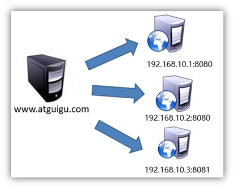

# 安装

<http://nginx.org/en/download.html>

alibaba cloud centos安装nginx教程：<https://www.cnblogs.com/wuxu-dl/p/10516325.html>

```
tar -zxvf nginx-1.20.0.tar.gz -C /opt/module/Copy to clipboardErrorCopied
```

pcre-8.35

```
wget http://downloads.sourceforge.net/project/pcre/pcre/8.35/pcre-8.35.tar.gz

tar -zxvf pcre-8.35.tar.gz -C /opt/module/

cd /opt/module/pcre-8.35/

./configure

make && make install

# 版本
pcre-config --versionCopy to clipboardErrorCopied
```

配置安装

```
cd nginx-1.20.0/

./configure --prefix=/opt/module/nginx --with-http_stub_status_module --with-http_ssl_module --with-pcre=/opt/module/pcre-8.35

make && make installCopy to clipboardErrorCopied
```

## 启动

```
sbin/nginxCopy to clipboardErrorCopied
```

访问<http://192.168.28.116/>

## 部署其他

部署前端，以Griffin为例

#### 部署到服务器

```
npm run-script buildCopy to clipboardErrorCopied
```

得到`dist`

把 dist 文件夹下的打包文件拷贝到 nginx/html 下并重命名为 griffinUI

修改 `conf/nginx.conf `文件

```
location / {
   root html/griffinUI;
   index index.html index.htm;
}Copy to clipboardErrorCopied
```

启动 nginx

```
sbin/nginxCopy to clipboardErrorCopied
```

在浏览器中输入[http://192.168.28.116/即可看到项目](http://192.168.28.116/%E5%8D%B3%E5%8F%AF%E7%9C%8B%E5%88%B0%E9%A1%B9%E7%9B%AE)

> 阿里云服务器如果无法访问，那么需要在conf文件首部加上
>
> ```
> user  root;Copy to clipboardErrorCopied
> ```

## 一些命令

```
(base) [root@glong sbin]# ./nginx -s reload        # 重新加载配置
(base) [root@glong sbin]# ./nginx -s reopen        #  
(base) [root@glong sbin]# ./nginx -s stop          #停止
```


## 自己操作过的步骤

### Nginx入门

#### **简介** 

*Nginx* ("engine x") 是一个高性能的HTTP**和反向代理服务器**,特点是占有内存少，并发能力强，事实上nginx的并发能力确实在同类型的网页服务器中表现较好，中国大陆使用nginx网站用户有：百度、京东、新浪、网易、腾讯、淘宝等。

#### **Nginx** **功能** 

1) 反向代理

 

什么是反向代理？先看什么是正向代理

 

再看什么是反向代理

 

 

 

2) 负载均衡

 

负载均衡策略： 轮询

​               权重

​               备机

 

 

3) 动静分离

 

 

#### **3****.1.3** **安装** 

#####  **1****）** **yum****安装依赖包**

 

 

##### **2） 安装依赖包**

--prefix=要安装到的目录

 

##### **3） 启动、关闭命令n****ginx**

 

**如果启动时报错：**

 

 

 

 

#### **3****.1****.4**   **赋权限**

nginx占用80端口，默认情况下非root用户不允许使用1024以下端口

 

 

#### **3****.1****.****5**   **修改****/bigdata/nginx/conf/nginx.conf**

 

 

 

### **3.2**  **集群脚本**